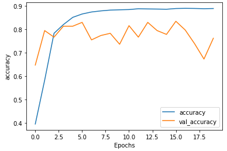

# 자녀 목소리 AI 애착인형 프로젝트


## 배경

> - 수명증가, 독거노인 증가, 고독사 등 `노인 세대`의 사회적 문제가 커지고 있다.
> - `코로나19`로 인해 활동이 제한되며 정서적 외로움, 우울증이 증가하고 있다.
> - 경제적, 신체적, 정서적 측면의 다양한 어려움이 있지만, `정서적 측면`에 집중하기로 결정


## 벤치마킹

> - 국내 : 효돌이 효순이
> - 국외 : 러봇
> - AI 기술을 인형에 접목하여, 알림, 대화 등 다양한 기능을 통해 어르신의 정서적 외로움을 해소


## 차별점

> - 자녀 목소리 합성 기능
> - 어르신 질문 데이터 기반 감정 분석
> - 어르신 감정 상태 인터페이스 제공


## 프로젝트 일정 및 기간

> - 전체기간 : `2021.04.28 ~ 2021.06.04` (약 1개월)
>   - `04.28 ~ 05.03` : 프로젝트 주제 선정 및 배경 탐색
>   - `05.05 ~ 05.25` : 각 파트 개발
>   - `05.17 ~ 05.18` : 중간점검 피드백
>   - `05.22` : 각 파트 기능 통합 완료
>   - `05.24 ~ 06.03` : 발표 준비 및 기능 업데이트 
>   - `2021.06.04` : 최종 발표 


## 기술 스택

> - Tensorflow2
> - Google Colab
> - AWS EC2
> - Konlpy
> - Scikit Learn
> - Numpy & Pandas


## 담당 역할

> - 말벗서비스 - 대화 기능 개발
> - PPT 제작


## 문제점

> - 어르신 맞춤 대화 데이터셋 구축 어려움
> - 어르신 대화 데이터 부족으로 딥러닝 대화 모델 성능 저하
> - 어르신 특성상 사투리 인식 어려움


## 해결 방안

> - AI hub 일상 대화, 건강 대화 데이터 활용하려 2,000개 이상 대화 데이터 확보
> - TF-IDF 와 코사인 유사도를 활용하여 예약어 기반 대화 모델 개발
> - 사투리 대화 데이터 자체제작하여 보강 (약 100개) 


## 배운점

> - 예약어 기반 댸화 프로세스 이해 및 개발 가능
> - RNN, LSTM, Seqeunce2Sequence, BERT 등 자연어 처리 관련 딥러닝 모델
> - AI 모델을 서비스로 실행하는 과정 이해
> - MQTT 프로토콜 숙지


## 수상

> - 개인 노력상 (총 60여명 중 10명 수상)


## 코드리뷰

> - `라이브러리 모음`

```python
from sklearn.feature_extraction.text import TfidfVectorizer
from sklearn.metrics.pairwise import linear_kernel
import pandas as pd
import numpy as np
import re
from konlpy.tag import Okt
from konlpy.tag import Mecab
from sklearn.metrics.pairwise import euclidean_distances # ==> 유클리디언 유사도
from sklearn.metrics.pairwise import manhattan_distances # ==> 맨하탄 유사도
```


> - `데이터 전처리`

```python
# 특수기호 제거
def text_preprocessing(self, text):
    sentence = text.split(' ')
    total_sentence = []
    for word in sentence:
        prepro_word = re.sub(r'[^ㄱ-ㅎㅏ-ㅣ가-힣0-9a-zA-Z]', '', word)
        total_sentence.append(prepro_word)
    result = ''.join(total_sentence)
    return result

# Okt 형태소 분석기 활용 토크나이징
def tokenize(self, text):
    okt = Okt()
    tokens = okt.pos(text, stem=True)
    total_words = []
    for word, tag in tokens:
        if tag not in ['Josa']:
            total_words.append(word)
    result = ' '.join(total_words)
    return result

# Mecab 형태소 분석기 활용 토크나이징
def mecab_tokenize(text):
    mecab = Mecab()
    select_token = []
    tokens = mecab.pos(text)
    for word, tag in tokens:
        if tag not in ['JKS', 'EC', 'JKB', 'JX', 'EP', 'NNB', 'VCP']:
            select_token.append(word)
    result = ' '.join(select_token)
    return result
```


> - `TF-IDF & 코사인 유사도`

```python
def cos_answer(self, new_q, new_df, df):
    tfidf = TfidfVectorizer()
    new_q = pd.Series(new_q)
    all_q = new_df.question.append(new_q)
    tfidf_matrix = tfidf.fit_transform(all_q)
    cosine_sim = linear_kernel(tfidf_matrix, tfidf_matrix)
    questions = cosine_sim[-1][:-1]
    if 1. in questions:
        indices = np.where(questions == 1.)
        indices = indices[0].tolist()
        q_idx = np.random.choice(indices, 1)
        return df.question[q_idx[0]], df.answer[q_idx[0]], questions[q_idx[0]]
    elif max(questions) < 0.45:
        return None, '아직 정확하게 답변하기 어려워요', max(questions)
    else:
        q_idx = questions.argsort()[-1]
        return df.question[q_idx], df.answer[q_idx], questions[q_idx]
```


> - `TF-IDF & 유클리디언 유사도`

```python
def euc_answer(new_q, new_df):
    tfidf = TfidfVectorizer()
    new_q = pd.Series(new_q)
    all_q = new_df.question.append(new_q)
    tfidf_matrix = tfidf.fit_transform(all_q)

    norm = np.sum(tfidf_matrix)
    tfidf_norm_l1 = tfidf_matrix / norm
    euc_sim = euclidean_distances(tfidf_norm_l1,tfidf_norm_l1)
    questions = euc_sim[-1][:-1]
    if 0. in questions:
        indices = np.where(questions == 0.)
        indices = indices[0].tolist()
        q_idx = np.random.choice(indices, 1)
        return df.answer[q_idx[0]]
    else:
        q_idx = questions.argsort()[0]
        return df.answer[q_idx]
```


> - `TF-IDF & 맨하탄 유사도`

```python
def manh_answer(new_q, new_df):
    tfidf = TfidfVectorizer()
    new_q = pd.Series(new_q)
    all_q = new_df.question.append(new_q)
    tfidf_matrix = tfidf.fit_transform(all_q)

    norm = np.sum(tfidf_matrix)
    tfidf_norm_l1 = tfidf_matrix / norm
    manht_sim = manhattan_distances(tfidf_norm_l1, tfidf_norm_l1)
    questions = manht_sim[-1][:-1]
    
    if 0. in questions:
        indices = np.where(questions == 0.)
        indices = indices[0].tolist()
        q_idx = np.random.choice(indices, 1)
        return df.answer[q_idx[0]]
    else:
        q_idx = questions.argsort()[0]
        return df.answer[q_idx]
```


> - `정답 예측`

```python
def predict(self, question, new_df, df):
    real_question = []
    real_answer = []
    sel_q = []
    cos = []

    new_q = self.text_preprocessing(question)
    new_q = self.tokenize(new_q)

    selected_question, selected_answer, cosin = self.cos_answer(new_q, new_df, df)

    real_question.append(question)
    real_answer.append(selected_answer)
    sel_q.append(selected_question)
    cos.append(cosin)

    result = pd.DataFrame({
        'question': real_question,
        'selected_question': sel_q,
        'cosine_similarity': cos,
        'answer': real_answer
    })

    return real_answer[0], sel_q[0], cos[0]
```


> - `MQTT + 대화 모델`

```python
class Led_Mqtt():
    def __init__(self,state,led_out,led_on,pwm):
        client = mqtt.Client()
        client.on_connect = self.on_connect
        client.on_message = self.on_message

        client.connect("13.209.193.138", 1883, 60)

        client.loop_forever()

    def on_connect(self,client, userdata, flags, rc):
        print("connect.." + str(rc))
        if rc == 0:
            client.subscribe("stt/test")
        else:
            print("connect fail..")
	
    # input text 받을 경우 아래 함수로 답변 출력 파일 생성
    def on_message(self, client, userdata, msg):
        self.myval = msg.payload.decode("utf-8")
        msg = self.myval

        DATA_PATH = './data_in/Total_chat_data.csv'
        NEW_DATA_PATH = './data_in/prepro_data.csv'
        df = pd.read_csv(DATA_PATH, encoding='utf-8')
        new_df = pd.read_csv(NEW_DATA_PATH, encoding='utf-8')

        result, sel_q, cosine = self.predict(msg, new_df, df)

        print(result)

        tts = gTTS(text=result, lang='ko')
        tts.save('test.wav')
```


> - `텍스트 유사도 딥러닝 MaLSTM 모델`

```python
class MaLSTM(tf.keras.Model):
    
    def __init__(self, **kargs):
        super(MaLSTM, self).__init__(name=model_name)
        self.embedding = layers.Embedding(input_dim=kargs['vocab_size'],
                                     output_dim=kargs['embedding_dimension'])
        self.lstm = layers.LSTM(units=kargs['lstm_dimension'])
        
    def call(self, x):
        x1, x2 = x
        x1 = self.embedding(x1)
        x2 = self.embedding(x2)
        x1 = self.lstm(x1)
        x2 = self.lstm(x2)
        x = tf.exp(-tf.reduce_sum(tf.abs(x1 - x2), axis=1))
        
        return x
```

```python
# Config
DATA_OUT_PATH = '/content/drive/MyDrive/Colab Notebooks/TF-IDF_Test/'
model_name = 'malstm_similarity'
BATCH_SIZE = 2
NUM_EPOCHS = 20
VALID_SPLIT = 0.1

kargs = {
    'vocab_size': prepro_configs['vocab_size'],
    'embedding_dimension': 100,
    'lstm_dimension': 150,
}
```


> - `model 정의`

```python
model = MaLSTM(**kargs)
model.compile(optimizer=tf.keras.optimizers.Adam(1e-3),
              loss=tf.keras.losses.BinaryCrossentropy(),
              metrics=[tf.keras.metrics.BinaryAccuracy(name='accuracy')])

checkpoint_path = DATA_OUT_PATH + '/weights.h5'
checkpoint_dir = os.path.dirname(checkpoint_path)

cp_callback = ModelCheckpoint(
    checkpoint_path, 
    monitor='val_accuracy', 
    verbose=1, 
    save_best_only=True, 
    save_weights_only=True)

# 학습
history = model.fit((q1_data, q2_data), 
                    labels, 
                    batch_size=BATCH_SIZE, 
                    epochs=NUM_EPOCHS,
                    validation_split=VALID_SPLIT,
                    verbose=1,
                    callbacks=[cp_callback])
```


> - `Accuracy 그래프`

```python
def plot_graphs(history, string):
    plt.plot(history.history[string])
    plt.plot(history.history['val_'+string], '')
    plt.xlabel("Epochs")
    plt.ylabel(string)
    plt.legend([string, 'val_'+string])
    plt.show()
```

```python
plot_graphs(history, 'accuracy')
```


